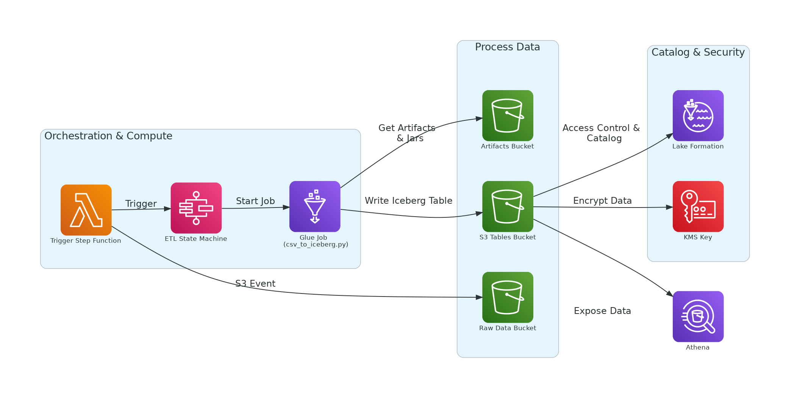

# AWS S3 Tables, Glue, Athena, Step Functions, and Lambda Integration

This project demonstrates a modern AWS data lake pipeline using S3 Tables, Glue, Athena, Step Functions, and Lambda. It covers both standard S3 buckets and S3 Tables buckets, and explains the necessary permissions and configurations for Lake Formation, Glue, and Athena.

---

## Table of Contents

- [Architecture](#architecture)
- [Prerequisites](#prerequisites)
- [Workflow Summary](#workflow-summary)
- [Setup Steps](#setup-steps)
- [Permissions and Lake Formation](#permissions-and-lake-formation)
- [S3 Tables vs Standard S3 Buckets](#s3-tables-vs-standard-s3-buckets)
- [References](#references)

---

## Architecture

- **Data Source:** CSV files in S3
- **Orchestration:** AWS Step Functions (see `state_machine.tf`)
- **Trigger:** AWS Lambda (see `lambdas/trigger_step_function.py`)
- **ETL:** AWS Glue job (PySpark, see `scripts/csv_to_iceberg.py`)
- **Data Lake Storage:** S3 bucket (standard or S3 Tables bucket, see `s3.tf` and `main.tf`)
- **Catalog:** AWS Glue Data Catalog (for Athena integration) or S3 Tables Catalog (for Spark-only use)
- **Query Engine:** Amazon Athena
- **Permissions:** Managed via IAM and Lake Formation

---

## Prerequisites

- AWS account with permissions for Glue, S3, Athena, Lambda, Step Functions, and Lake Formation
- [Terraform](https://www.terraform.io/) for infrastructure as code
- Docker (for building the Lambda)

---

## Workflow Summary

1. **S3 Upload:** A CSV file is uploaded to the raw data S3 bucket.
2. **Lambda Trigger:** The upload triggers the Lambda function, which starts the Step Function state machine.
3. **Step Function:** The state machine runs the Glue job, passing the S3 path and table parameters.
4. **Glue Job:** The Glue job reads the CSV, processes it, and writes it as an Iceberg table to the S3 warehouse (using either S3 Tables or standard S3).

---

## Setup Steps

For the setup steps you can visit the blog post I wrote [here](TBA).

## Permissions and Lake Formation

- **Lake Formation** manages access to S3 data locations and Glue Data Catalog resources.
- Your Glue job role must have:
  - `DATA_LOCATION_ACCESS` on the S3 warehouse path (see `main.tf`)
  - `CREATE_TABLE`, `ALTER`, `DROP`, etc. on the Glue database
- You do **not** need to make the Glue job role a Lake Formation admin; grant only the required permissions for least privilege.

---

## S3 Tables vs Standard S3 Buckets

- **Standard S3 Bucket:**
  - Fully supported by Glue, Athena, and Lake Formation
  - Use for maximum compatibility and analytics integration
- **S3 Tables Bucket:**
  - Managed by the S3 Tables service
  - Not always fully supported by Lake Formation for data location permissions
  - Tables may not be visible in Athena unless registered in Glue Data Catalog
  - Best for Spark-only or S3 Tables-specific use cases

---

## References

- [AWS Glue Documentation](https://docs.aws.amazon.com/glue/index.html)
- [AWS Lake Formation Documentation](https://docs.aws.amazon.com/lake-formation/index.html)
- [Apache Iceberg Documentation](https://iceberg.apache.org/)
- [AWS S3 Tables Documentation](https://docs.aws.amazon.com/AmazonS3/latest/userguide/s3-glacier-select-sql-reference-select.html)
- [AWS Step Functions Documentation](https://docs.aws.amazon.com/step-functions/)
- [AWS Lambda Documentation](https://docs.aws.amazon.com/lambda/)

---

If you have any questions or suggestion you can always write in the comment section of the [blog post](TBA).